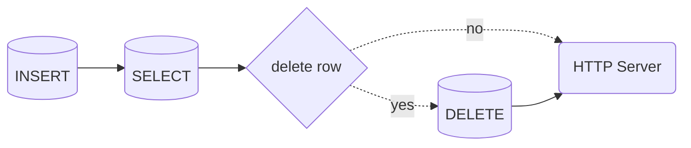

# mariadb-healthcheck
[](https://github.com/richie-tt/mariadb-healthcheck/actions)
[](https://codecov.io/gh/richie-tt/mariadb-healthcheck)

## Overview

This project provides a sidecar container for **MariaDB** pods in Kubernetes, specifically designed to perform basic commands like `INSERT`, `SELECT`, and `DELETE` on a dedicated database and expose the result as a HTTP endpoint. This allow Kubernetes to restart the **MariaDB** container if the database is not healthy.

### How it works

`mariadb-healthcheck` will perform a database check by executing `INSERT`, `SELECT`, and `DELETE` commands in sequence. To understand the process, refer to the flowchart.



Based on the results of the check, Kubernetes will restart the specified containers. Now the key is to configure `livenessProbe` and `readinessProbe` for the MariaDB service,
so if the healthcheck returns an error, MariaDB will be restarted.

I also highly recommend configuring `livenessProbe` and `readinessProbe` for the `mariadb-healthcheck` container, in case it hangs. Please refer to the diagram below.


## Usage

Environment variables:

| Variable    | Required | Default       | Description                                                                                                                                         |
| ----------- | -------- | ------------- | --------------------------------------------------------------------------------------------------------------------------------------------------- |
| DELETE_ROW  | No       | `true`        | After executing `INSERT` and `SELECT` commands, `DELETE` command can be skipped by setting this variable to `false`, useful for debugging purposes. |
| DB_HOST     | No       | `127.0.0.1`   | Address of the database.                                                                                                                            |
| DB_NAME     | No       | `healthcheck` | Name of the MariaDB database, where checks will be performed.                                                                                       |
| DB_PASSWORD | No       | `healthcheck` | MariaDB user password.                                                                                                                              |
| DB_PORT     | No       | `3306`        | MariaDB port.                                                                                                                                       |
| DB_USER     | No       | `healthcheck` | MariaDB user name.                                                                                                                                  |
| HEALTH_PORT | No       | `8080`        | The port of HTTP server, where status of check is exposed.                                                                                          |
| LOG_LEVEL   | No       | `info`        | Log level, available options are `debug`, `info`, `warn`, `error`.                                                                                  |


## Installation

### Database

Create a database and a user with the following permissions:

```sql
CREATE DATABASE `healthcheck` /*!40100 DEFAULT CHARACTER SET utf8mb4 COLLATE utf8mb4_unicode_ci */;
CREATE USER 'healthcheck'@'127.0.0.1' IDENTIFIED BY 'healthcheck';
GRANT ALL PRIVILEGES ON `healthcheck`.* TO 'healthcheck'@'127.0.0.1';
```

Create a table with a specially selected engine. It is important to understand that different engines have different characteristic properties, I would consider the following:

- `ENGINE=MEMORY` will perform a check on the database which is stored in memory and all the data for the check will be lost after the container is restarted,
  this is not a problem for `mariadb-healthcheck` as it just executes simple commands like `INSERT`, `SELECT` and `DELETE` on the database.

  This engine can be a good choice if you want to check the health of the database without affecting its performance.

  > [!WARNING]
  >  You need to be aware that `MEMORY` engine will not check if the Kubernetes `volume` is configured correctly to preform the write operation.

- `ENGINE=ARIA` will perform a database check that stores the result of the operation on disk, which will allow you to get a better overview of the database status.
  This engine can have a negative impact on the performance of the database where a huge load is expected.


```sql
CREATE TABLE healthcheck.status (
	uuid varchar(50) NOT NULL
)
ENGINE=ARIA
DEFAULT CHARSET=utf8mb4
COLLATE=utf8mb4_unicode_ci;
```

### Deployment

Add the sidecar container to your MariaDB pod definition:

```yaml
apiVersion: apps/v1
kind: Deployment
metadata:
  name: mariadb
  labels:
    app: mariadb
spec:
  replicas: 1
  strategy:
    type: Recreate
  selector:
    matchLabels:
      app: mariadb
  template:
    metadata:
      labels:
        app: mariadb
    spec:
      containers:
        # This container is used to check the health of the database
        - name: healthcheck
          image: richiett/mariadb-healthcheck:latest
          readinessProbe:
            httpGet:
              path: /health
              port: 8080
              scheme: HTTP
            failureThreshold: 4
            initialDelaySeconds: 15
            periodSeconds: 15
            successThreshold: 1
            timeoutSeconds: 5
          livenessProbe:
            httpGet:
              path: /health
              port: 8080
              scheme: HTTP
            failureThreshold: 1
            initialDelaySeconds: 10
            periodSeconds: 15
            successThreshold: 1
            timeoutSeconds: 5
          ports:
            - name: healthcheck
              containerPort: 8080

        # This container is the MariaDB container
        - name: mariadb
          image: mariadb
          ports:
            - name: mariadb
              containerPort: 3306

          # It's important to add a readinessProbe and livenessProbe to the MariaDB container, which points to the healthcheck container.
          readinessProbe:
            httpGet:
              path: /health
              port: 8080
              scheme: HTTP
            failureThreshold: 4
            initialDelaySeconds: 15
            periodSeconds: 15
            successThreshold: 1
            timeoutSeconds: 5
          livenessProbe:
            httpGet:
              path: /health
              port: 8080
              scheme: HTTP
            failureThreshold: 1
            initialDelaySeconds: 10
            periodSeconds: 15
            successThreshold: 1
            timeoutSeconds: 5
```

## Resources:

- [Docker image](https://hub.docker.com/r/richiett/mariadb-healthcheck)
