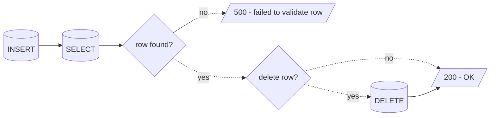

# mariadb-healthcheck
[](https://github.com/richie-tt/mariadb-healthcheck/actions)
[](https://codecov.io/gh/richie-tt/mariadb-healthcheck)

## Overview

This project provides a sidecar container for **MariaDB** pods in Kubernetes, specifically designed to perform basic commands like `INSERT`, `SELECT`, and `DELETE` on a dedicated database and expose the result as a HTTP endpoint. This allow Kubernetes to restart the **MariaDB** container if the database is not healthy.

### How it works

On every `GET /health` request, `mariadb-healthcheck` runs `INSERT → SELECT → DELETE` synchronously against a dedicated `status` table and returns the result. There is **no background polling** — each probe triggers exactly one round-trip to MariaDB.


```mermaid
flowchart LR
    A[(INSERT)] --> B[(SELECT)]
    B --> V{row found?}
    V -.-> |no|F[/500 - failed to validate row/]
    V -.-> |yes|C{delete row?}
    C -.-> |yes|D[(DELETE)]
    C -.-> |no|E[/200 - OK/]
    D --> E
```

Based on the results of the check, Kubernetes will restart the specified containers. Configure `livenessProbe` and `readinessProbe` for the MariaDB container to point at the sidecar's `/health`, so if the healthcheck returns an error, MariaDB will be restarted.

It's also recommended to configure `livenessProbe` and `readinessProbe` for the `mariadb-healthcheck` container itself, in case it hangs. Please refer to the diagram below.


### Response semantics

| HTTP status | Body | Meaning |
| --- | --- | --- |
| `200` | `OK` | Round-trip succeeded. |
| `500` | `failed to insert row` | The `INSERT` statement returned an error. |
| `500` | `failed to select row` | The `SELECT` statement returned an error. |
| `500` | `failed to scan row` | Driver-level error reading the row from the result set. |
| `500` | `failed to validate row` | The `SELECT` returned no rows — the row that was just inserted is missing. Indicates storage corruption, replication lag, or a misconfigured engine. |
| `500` | `failed to delete row` | The `DELETE` statement returned an error (only emitted when `DELETE_ROW=true`). |
| `500` | `healthcheck failed` | An unexpected error type — should not occur in normal operation; treat as a bug. |

All responses set `Content-Type: text/plain; charset=utf-8`.

## Usage

Environment variables:

| Variable    | Required | Default       | Description                                                                                                                                         |
| ----------- | -------- | ------------- | --------------------------------------------------------------------------------------------------------------------------------------------------- |
| DELETE_ROW  | No       | `true`        | After executing `INSERT` and `SELECT` commands, `DELETE` command can be skipped by setting this variable to `false`, useful for debugging purposes. |
| DB_HOST     | No       | `127.0.0.1`   | Address of the database.                                                                                                                            |
| DB_NAME     | No       | `healthcheck` | Name of the MariaDB database, where checks will be performed.                                                                                       |
| DB_PASSWORD | **Yes**  | _(none)_      | MariaDB user password. The container will refuse to start if this is unset.                                                                         |
| DB_PORT     | No       | `3306`        | MariaDB port.                                                                                                                                       |
| DB_USER     | No       | `healthcheck` | MariaDB user name.                                                                                                                                  |
| HEALTH_PORT | No       | `8080`        | The port of HTTP server, where status of check is exposed.                                                                                          |
| LOG_LEVEL   | No       | `info`        | Log level, available options are `debug`, `info`, `warn`, `error`.                                                                                  |


## Installation

### Database

Create a database and a user with the following permissions. Replace the literal `healthcheck` password with a strong, unique secret — `DB_PASSWORD` must be set explicitly when running the sidecar (there is no fallback default):

```sql
CREATE DATABASE `healthcheck` /*!40100 DEFAULT CHARACTER SET utf8mb4 COLLATE utf8mb4_unicode_ci */;
CREATE USER 'healthcheck'@'127.0.0.1' IDENTIFIED BY 'healthcheck';
GRANT ALL PRIVILEGES ON `healthcheck`.* TO 'healthcheck'@'127.0.0.1';
```

The DSN supports passwords with arbitrary characters (`@`, `:`, `/`, `?`, `#`, etc.) — they are escaped automatically by the driver.

Create a table with a specially selected engine. It is important to understand that different engines have different characteristic properties, I would consider the following:

- `ENGINE=MEMORY` will perform a check on the database which is stored in memory and all the data for the check will be lost after the container is restarted,
  this is not a problem for `mariadb-healthcheck` as it just executes simple commands like `INSERT`, `SELECT` and `DELETE` on the database.

  This engine can be a good choice if you want to check the health of the database without affecting its performance.

  > [!WARNING]
  >  You need to be aware that `MEMORY` engine will not check if the Kubernetes `volume` is configured correctly to preform the write operation.

- `ENGINE=ARIA` will perform a database check that stores the result of the operation on disk, which will allow you to get a better overview of the database status.
  This engine can have a negative impact on the performance of the database where a huge load is expected.


```sql
CREATE TABLE healthcheck.status (
	uuid varchar(50) NOT NULL
)
ENGINE=ARIA
DEFAULT CHARSET=utf8mb4
COLLATE=utf8mb4_unicode_ci;
```

### Deployment

Store the database password in a Kubernetes `Secret`:

```yaml
apiVersion: v1
kind: Secret
metadata:
  name: mariadb-healthcheck
type: Opaque
stringData:
  password: choose-a-strong-password
```

Then add the sidecar container to your MariaDB pod definition. `DB_PASSWORD` is **required** — the container refuses to start without it. Probe settings below use `startupProbe` to tolerate slow MariaDB cold starts (up to ~150s) and a `failureThreshold` of `3` on `livenessProbe` so a single transient error doesn't kill the pod:

```yaml
apiVersion: apps/v1
kind: Deployment
metadata:
  name: mariadb
  labels:
    app: mariadb
spec:
  replicas: 1
  strategy:
    type: Recreate
  selector:
    matchLabels:
      app: mariadb
  template:
    metadata:
      labels:
        app: mariadb
    spec:
      # Allow up to 30s to drain in-flight probes on shutdown.
      terminationGracePeriodSeconds: 30
      containers:
        # This container checks the health of the database.
        - name: healthcheck
          image: richiett/mariadb-healthcheck:latest
          env:
            - name: DB_PASSWORD
              valueFrom:
                secretKeyRef:
                  name: mariadb-healthcheck
                  key: password
            # DB_USER, DB_HOST, DB_PORT, DB_NAME default to the values
            # documented in the Usage section. Override them here if your
            # MariaDB user / database is named differently.
          ports:
            - name: healthcheck
              containerPort: 8080
          startupProbe:
            httpGet:
              path: /health
              port: 8080
              scheme: HTTP
            # Up to 30 attempts × 5s = 150s for MariaDB to come up.
            failureThreshold: 30
            periodSeconds: 5
            timeoutSeconds: 5
          readinessProbe:
            httpGet:
              path: /health
              port: 8080
              scheme: HTTP
            failureThreshold: 3
            periodSeconds: 10
            timeoutSeconds: 5
          livenessProbe:
            httpGet:
              path: /health
              port: 8080
              scheme: HTTP
            failureThreshold: 3
            periodSeconds: 30
            timeoutSeconds: 5

        # This is the MariaDB container.
        - name: mariadb
          image: mariadb
          ports:
            - name: mariadb
              containerPort: 3306
          # MariaDB has no built-in HTTP healthcheck; both probes target
          # the sidecar's /health.
          startupProbe:
            httpGet:
              path: /health
              port: 8080
              scheme: HTTP
            failureThreshold: 30
            periodSeconds: 5
            timeoutSeconds: 5
          readinessProbe:
            httpGet:
              path: /health
              port: 8080
              scheme: HTTP
            failureThreshold: 3
            periodSeconds: 10
            timeoutSeconds: 5
          livenessProbe:
            httpGet:
              path: /health
              port: 8080
              scheme: HTTP
            failureThreshold: 3
            periodSeconds: 30
            timeoutSeconds: 5
```

### Operations

A few facts worth knowing when running the sidecar:

- **Connection pool.** The sidecar caps DB connections at `MaxOpen=2`, `MaxIdle=1`, with a 5-minute lifetime. Sized for one liveness + one readiness probe in flight at a time. Don't tune K8s probe `periodSeconds` below ~5s without revisiting this.
- **Per-request timeout.** Each `/health` invocation has a 5-second context timeout covering INSERT + SELECT + (optional) DELETE. Set probe `timeoutSeconds` to ≥ 5 so K8s doesn't cancel a check that's still in-flight.
- **Graceful shutdown.** On `SIGTERM` / `SIGINT` the HTTP server stops accepting new requests, waits up to 5 seconds for in-flight probes to finish, then closes the DB connection. Set `terminationGracePeriodSeconds` ≥ 10 in the pod spec.
- **No background polling.** Each probe triggers exactly one DB round-trip. There is no cached result.
- **Logging.** Errors are logged once at the boundary (`msg=healthcheck failed error=…`). At `LOG_LEVEL=debug` the per-stage queries are also logged. Set via the `LOG_LEVEL` env var.

## Resources:

- [Docker image](https://hub.docker.com/r/richiett/mariadb-healthcheck)
